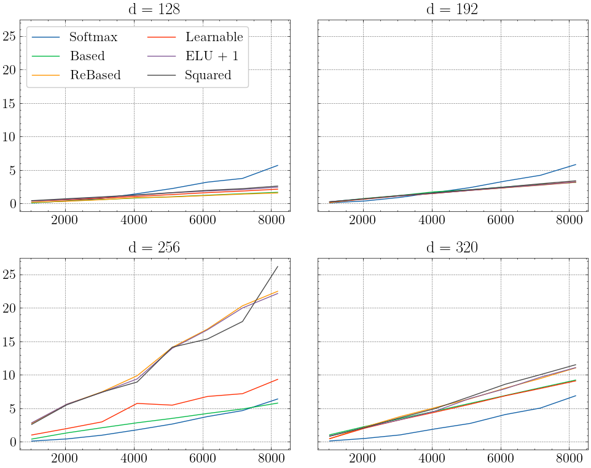

# Некоторые особенности линейных трансформеров

Недавно исследователи из T-Bank представили модификацию трансформерной архитектуры на конференции ACL в Бангкоке [1]. Я предпринял попытку разобраться в том, как она устроена, и решил поделиться результатами, а заодно провести небольшое исследование различных вариаций линейного трансформера и его свойств.

## Введение: Scaled Dot-Product Softmax Self-Attention

Для начала мы рассмотрим, как устроен самый обычный механизм внимания, предложенный в 2017 году.

Получив матрицу $X \in \mathbb{R}^{N \times d}$, где $N$ означает число входных токенов, а d - внутреннюю размерность модели, мы вычисляем различные обучаемые проекции этой матрицы и применяем к ним преобразования следующего вида:

```math
Q=W_QX, \quad K = W_KX, \quad V = W_VX

```

```math 
\text{Attention}(Q, K, V) =\text{softmax}\bigg(\frac{QK^T}{\sqrt{d}}\bigg)V

```

Основной особенностью механизма внимания является возможность оценить взаимосвязи между токенами. Скалярное произведение даёт нам некоторую меру сходства двух векторов, соответственно в получаемой $N \times N$ матрице элементы представляют собой величину попарного сходства каждого вектора из $Q$ с каждым вектором из $K$. 

Рассмотрим матрицу $\text{S} = \text{softmax}(QK^T)$. Софтмакс позволяет получить сглаженные значения попарного сходства векторов и вместе с этим даёт возможность рассматривать каждую строку как распределение вероятностей. Поэтому иногда говорят, что механизм внимания говорит нам о том, с какой вероятностью каждый токен смотрит на все остальные токены. На самом деле мы могли бы использовать вместо софтмакса нечто, напоминающее его по своему поведению, в частности просто деление каждой строки $QK^T$ на сумму её элементов, но это вытекает в худшую вычислительную стабильность и некоторые иные свойства самого механизма внимания.

Деление на $\sqrt{d}$ нужно с точки зрения статистических особенностей механизма внимания. Если $Q$ и $K$ нормализованы построчно, т.е. среднее каждой строки равно нулю, а стандартное отклонение - единице, то $QK^T$ будет иметь стандартное отклонение $\sqrt{d}$ (и среднее ноль). В этом несложно убедиться с использованием синтетических примеров.

В определённых случаях, в частности при генерации текста, мы хотим ограничить наш механизм внимания - например, запретить токену "обращать внимание" на все последующие токены. Такой подход называется каузальным вниманием, а с вычислительной точки зрения он реализуется посредством добавления маски перед применением функции софтмакса: все элементы выше диагонали мы заменяем на $-\infty$, и после применения софтмакса они обратятся в ноль.

Примерно так может выглядеть реализация слоя внимания:

```python
class Attention(nn.Module):
    def __init__(self, config):
        super().__init__()
        assert config.hidden_dim % config.attn_heads == 0
        
        self.attn = nn.Linear(config.hidden_dim, 3 * config.hidden_dim)
        self.linear = nn.Linear(config.hidden_dim, config.hidden_dim)
        
        self.hidden_dim = config.hidden_dim
        self.attn_heads = config.attn_heads
    
    def forward(self, x):
        B, N, d = x.size()
        
        QKV = self.attn(x)
        Q, K, V = QKV.split(self.hidden_dim, dim = 2)

        # После этих преобразований матрицы будут иметь размер [B, h, N, d]
        Q = Q.view(B, N, self.attn_heads, d // self.attn_heads).transpose(1, 2)
        K = K.view(B, N, self.attn_heads, d // self.attn_heads).transpose(1, 2) 
        V = V.view(B, N, self.attn_heads, d // self.attn_heads).transpose(1, 2)

        # ---------------- Отсюда идёт сам механизм внимания ------------------
        
        # Эта маска может формироваться заранее
        mask = torch.tril(torch.ones(N, N)).view(1, 1, N, N)
        
        logits = Q @ K.transpose(-2, -1) / math.sqrt(d)
        logits = logits.masked_fill(mask[:,:,:N,:N] == 0, float('-inf'))
        scores = torch.softmax(logits, -1)
        
        out = (scores @ V).transpose(1, 2).contiguous().view(B, N, d)

        # Полученная матрица out представляет собой несколько конкатенированных 
        # голов внимания, которые пока что друг с другом не взаимодействовали и
        # содержат самостоятельную информацию, поэтому мы их собираем воедино
        out = self.linear(out)
        
        return out
```

На самом деле мы не обязаны применять софтмакс. Поскольку идея заключается в том, чтобы оценить сходство между векторами из $Q$ и из $K$, мы можем использовать разнообразные способы его оценки. Рассмотрим построчно наш механизм внимания и выразим его так:

```math
O_i = \frac{\sum_{j = 0}^{k} \text{sim}(Q_i, K_j)V_j}{\sum_{n = 0}^{k} \text{sim}(Q_i, K_n)}
```

Если $k = i$, то мы вычисляем каузальное внимание. В случае рассмотренного ранее варианта внимания мы получаем

```math
\text{sim}(Q_i, K_j) = \text{exp}(Q_i^T K_j) \quad \longrightarrow \quad O_i = \frac{\sum_{j = 0}^{k} \text{exp}(Q_i^T K_j)V_j}{\sum_{n = 0}^{k} \text{exp}(Q_i^T K_j)}
```

А что ещё мы можем делать? Давайте далеко не уходить от внимания с софтмаксом и попробуем аппроксимировать его с помощью разложения в многочлен Тейлора (это нам в некоторой степени пригодится в дальнейшем):

```math
\text{exp}(Q_i^T K_j) \approx \sum_{i = 0}^{m} \frac{(Q_i^T K_i)^i}{i!}
```

```python
def taylor(Q, K, V, m = 2):
    # Предполагаем, что матрицы уже были разбиты на несколько голов
    B, h, N, d = V.size()
    
    # Будем аппроксимировать поэлементно. Для этого сохраним матрицу 
    # logits и будем возводить её в степень и делить, а в scores будем
    # сохранять полученный результат. Инициализируем scores единицами
    # и установим нули выше диагонали (так мы сохраним каузальность).
    
    mask = torch.tril(torch.ones(N, N)).view(1, 1, N, N)
    logits = (Q @ K.transpose(-2, -1)).masked_fill(mask[:, :, :N, :N] == 0, 0)
    scores = torch.ones_like(logits).masked_fill(mask[:, :, :N, :N] == 0, 0)

    for i in range(1, m + 1):
        scores += (logits ** i) / math.factorial(i)
    scores = scores / scores.sum(-1, keepdim=True)
    
    out = scores @ V
    return out
```

Примерно так может выглядеть реализация, причём при увеличении порядка аппроксимации мы всё лучше приближаем софтмакс внимание, как от него и ожидается. Теперь перейдём к интересующей нас теме.

## Линейный трансформер

Нам хотелось бы обрабатывать длинные последовательности, однако вычислительная сложность рассматриваемого механизма внимания - $O(N^2)$. С этим можно попытаться бороться, изменив подход к вычислению внимания.

Подойдём слегка абстрактно. Рассмотрим некоторую функцию следующего рода:

```math
\phi : \mathbb{R}^d \to \mathbb{R}^{\hat{d}} : \quad \text{sim}(Q_i, K_j) = \phi^T(Q_i)\phi(K_i)
```

Мы можем применить её построчно к матрицам $Q$ и $K$. Тогда в силу ассоциативности матричного умножения мы можем изменить порядок вычислений:

```math
\Big(\phi(Q)\phi^T(K)\Big)\phi(V) = \phi(Q)\Big(\phi^T(K)\phi(V)\Big)
```

В нашей построчной записи это выразится как

```math
O_i = \frac{\sum_{j = 0}^{k} \phi^T(Q_i) \phi(K_j)V_j}{\sum_{n = 0}^{k} \phi^T(Q_i) \phi(K_n)} = \frac{\phi^T(Q_i) \sum_{j = 0}^{k} \phi(K_j)V_j^T}{\phi^T(Q_i) \sum_{n = 0}^{k} \phi(K_n)}
```

Теперь мы сначала будем вычислять матрицу $d \times d$ вместо $N \times N$. Это позволяет нам изменить сложность квадратичного внимания на . Собственно, теперь основным вопросом является выбор такой функции $\phi$, которая даст нам лучшее качество.

В статье [2] приводится анализ стандартного механизма внимания и делается вывод о том, что он обладает рядом привлекательных свойств и вместе с этим показывает лучшие результаты по сравнению с различными предложенными механизмами линейного внимания. Авторы используют параметризованные $\phi$ и учат их как часть модели таким образом, чтобы аппроксимировать софтмакс внимание. Однако что ещё можно сделать?

В статье [3] была введена архитектура Based, и в ней предлагается брать такую $\phi$, которая позволит нам аппроксимировать разложение софтмакса в ряд Тейлора:

```math
\phi^T(Q_i) \phi(K_j) \approx \text{exp}(Q_i^T K_j)\approx 1 + Q_i^T K_j + \frac{1}{2}(Q_i^T K_j)^2
```

Идея здесь будет следующей. Пусть $x_i$ - элемент вектора $x$, тогда результат выполнения функции $\phi$ будет представлять собой расширение вектора, в котором первый элемент будет единицей, затем идут элементы $x$, а следом все попарные произведения его элементов. В результате получится ожидаемое разложение:

```math
\phi(x)=(1,kx_1,...,kx_n, lx_1^2, lx_1x_2,...,lx_n^2)
```

```math 
\phi^T(Q_i) \phi(K_j) = 1 + k^2Q_i^TK_j+l^2(Q_i^TK_j)^2
```

В качестве коэффициентов мы возьмём $k = 1/\sqrt[2]{d}$ и $l = 1/\sqrt{2d}$. Интересным образом оказывается, что этот механизм внимания и наша реализация функции `taylor` при совпадают (для этого мы её и делали). Можем проверить на разнообразных данных:

```python
import torch
import numpy as np

from tqdm.notebook import tqdm_notebook as tqdm

def normalize(x):
    mean = x.mean(dim=-1, keepdim=True)
    std = x.std(dim=-1, keepdim=True)
    return (x - mean) / (std + 1e-6)

def phi(x):
    d = x.size(-1)
    x2 = (x.unsqueeze(-1) * x.unsqueeze(-2)).flatten(start_dim=-2)
    return torch.cat([
        torch.ones(x[..., :1].shape),
        x / math.sqrt(math.sqrt(d)),
        x2 / math.sqrt(2) / math.sqrt(d)
    ], dim = -1)

def linear(Q, K, V):
    B, h, N, d = V.size()
    Q = phi(Q)
    K = phi(K)
    # Это эффективное вычисление каузального линейного внимания
    kv = torch.einsum('bhtf, bhtg -> bhtfg', K, V).cumsum(dim=2)
    Z = 1 / (torch.einsum("bhtf, bhtf -> bht", Q, K.cumsum(2)) + 1e-6)
    out = torch.einsum('bhtf, bhtfg -> bhtg', Q, kv) * Z[:, :, :, None]
    return out

res = []

bs = [1, 2, 4, 6, 8]
ns = [16, 32, 48, 64, 96]
ds = [2 ** i for i in range(2, 9)]

for i in tqdm(range(32)):
    B, N, d = (np.random.choice(bs), 
               np.random.choice(ns),
               np.random.choice(ds))

    Q = torch.normal(0, 2, (B, N, d))
    K = torch.normal(0, 2, (B, N, d))
    V = torch.normal(0, 2, (B, N, d))

    Q, K, V = normalize(Q), normalize(K), normalize(V)

    attn_heads = 4
    Q = Q.view(B, N, attn_heads, d // attn_heads).transpose(1, 2)
    K = K.view(B, N, attn_heads, d // attn_heads).transpose(1, 2)
    V = V.view(B, N, attn_heads, d // attn_heads).transpose(1, 2)

    res.append((linear(Q, K, V) - taylor(Q, K, V, 2)).norm())

print(f'Mean: {np.mean(res):.5f}, STD: {np.std(res):.5f}')
# Mean: 0.00005, STD: 0.00008
```

Вообще говоря, в оригинальной реализации Based у авторов также есть и вручную указываемые коэффициенты для каждого элемента в разложении Тейлора, но нас это не сильно интересует.

## Модель ReBased

Однако, если мы задаёмся целью аппроксимировать софтмакс, то возникает проблема - аппроксимация-то плохая. Мы могли бы увеличить порядок аппроксимации, просто изменив функцию $\phi$ и добавив в неё все возможные перемножения вплоть до требуемого порядка, но это, на наш взгляд, довольно-таки неэффективно, особенно потому, что с изменением длины последовательности, внутренней размерности и числа голов внимания мы также меняем и качество такой аппроксимации вплоть до полной непригодности. Другая проблема заключается в том, как именно происходит оценка величины внимания: чем меньше схожесть $\text{sim}(q, k)$, тем меньше соответственно должна быть величина внимания, однако в случае Based парабола имеет минимум в точке $q^Tk = -1$. Вероятно, это потому, что матрицы $Q, K$ подразумеваются нормализованными, а тогда минимальное значение их скалярного произведения равно $-1$. Этот минимум, как обнаружили авторы статьи [1], не равен нулю.

Собственно в статье [1] предлагается изменить метод Based так: давайте введём обучаемые параметры в функцию $\phi$, но возьмём не совсем ту параболу, которая предложена в архитектуре Based, а только элементы второго порядка. Пусть $Q, K \in \mathbb{R}^{N \times d / h}$, тогда

```math
\gamma_Q, \gamma_K, \beta_Q, \beta_K \in \mathbb{R}^{d / h}
```

```math 
\phi_Q(Q) \phi^T_K(K) = \big((\gamma_QQ + \beta_Q) (\gamma_KK + \beta_K)^T\big)^2
```

Функция  применяется построчно. Полученный механизм внимания можно записать так:

```python
class ReBasedKernel(nn.Module):
    def __init__(self, config):
        super(Kernel, self).__init__()

        self.gamma = nn.Parameter(torch.rand(config.hidden_dim // config.attn_heads))
        self.beta = nn.Parameter(torch.rand(config.hidden_dim // config.attn_heads))
        self.rd = math.sqrt(config.hidden_dim)
        
    def forward(self, x):
        # Авторы [1] добавляют нормализацию и мы добавим (хоть и не как у них)
        x = self.gamma * normalize(x) + self.beta
        x2 = (x.unsqueeze(-1) * x.unsqueeze(-2)).flatten(start_dim=-2)
        return x2 / self.rd

class ReBasedAttention(nn.Module):
    def __init__(self, config):
        super().__init__()
        assert config.hidden_dim % config.attn_heads == 0
        
        self.attn = nn.Linear(config.hidden_dim, 3 * config.hidden_dim)
        self.linear = nn.Linear(config.hidden_dim, config.hidden_dim)
        
        self.phiq = Kernel(config)
        self.phik = Kernel(config)
        
        self.hidden_dim = config.hidden_dim
        self.attn_heads = config.attn_heads
    
    def forward(self, x):
        B, N, d = x.size()
        
        QKV = self.attn(x)
        Q, K, V = QKV.split(self.hidden_dim, dim=2)
        
        Q = Q.view(B, N, self.attn_heads, d // self.attn_heads).transpose(1, 2)
        K = K.view(B, N, self.attn_heads, d // self.attn_heads).transpose(1, 2) 
        V = V.view(B, N, self.attn_heads, d // self.attn_heads).transpose(1, 2)

        # [B, h, T, d / h] -> [B, h, T, (d / h) ** 2]
        Q, K = self.phiq(Q), self.phik(K)
        
        kv = torch.einsum('bhtf, bhtg -> bhtfg', K, V).cumsum(dim=2)
        Z = 1 / (torch.einsum("bhtf, bhtf -> bht", Q, K.cumsum(2)) + 1e-6)
        out = torch.einsum('bhtf, bhtfg -> bhtg', Q, kv) * Z[:, :, :, None]
        
        out = out.transpose(1, 2).contiguous().view(B, N, d)
        out = self.linear(out)
        
        return out
```

Особенностью полученного механизма является следующее: наша парабола, которая отвечает за величину внимания, подстраивается во время обучения и "самостоятельно" решает, как именно нужно оценивать величину схожести между двумя векторами. А поскольку мы выбрали определённый вид параболы, она имеет один корень и все её значения неотрицательны, что в целом замечательно удовлетворяет нашим ожиданиям от меры сходства векторов.

Другое интересное наблюдение заключается в том, что в полученном методе мы, по сути, применяем нечто вроде Layer Normalization и затем формируем вектор из попарных произведений. Роль LayerNorm в механизме внимания описана, например, в работе [4], соответственно прирост в качестве благодаря нововведению в работе [1] может быть также объяснён посредством более эффективной репрезентации векторов в $Q$ и $K$ матрицах, особенно потому, что при добавлении нормализации качество алгоритмов улучшается.

## Немного про оптимизацию

Дело в том, что линейный алгоритм имеет сложность $O(dN^2)$, а мы как раз посредством  увеличиваем $d$. В итоге почти весь выигрыш в скорости теряется из-за значительного увеличения наиболее чувствительной части алгоритма: в случае модели Based каждая строка в результирующей матрице станет иметь размер $1 + d + d^2$, а в случае ReBased - $d^2$ (это ещё не говоря о том оверхеде, который вызывает применение функции $\phi$ в каждом из методов).

У нас есть три пути: ничего не менять и оставить как есть (но тогда методы работают во много раз дольше софтмакс внимания), выбрать другую $\phi$ с которой таких проблем не будет, или взять

```math
W_Q, W_K \in \mathbb{R}^{d \times \hat{d}} : \quad 1 + \hat{d} / h + (\hat{d} / h)^2 \approx d/h \quad \text{или} \quad (\hat{d} / h)^2 \approx d
```

Почему так? Если у модели $d = 256$ и $h = 4$, то $d / h = 64$. Это размерность одной головы. Поскольку мы применяем  именно к этой размерности (и слава Богу), в методе Based она вырастет с $64$ до $4161$, а в ReBased до $4096$. Мы не хотим терять в производительности, поэтому мы можем заранее выбрать такую размерность, чтобы в результате применения функции $\phi$ мы получили размерность, близкую к $64$. Если мы возьмём $\hat{d} = 24$, то размерность как раз будет равна $64$, поскольку $(24 / 4)^2 = 64$. 

Чтобы сделать вещи слегка менее запутанными, мы будем при формировании конфига вычислять наиболее оптимальное $\hat{d}$ таким образом, чтобы $(\hat{d} / h)^2$ было наиболее близким к $d / h$. Тогда мы получим небольшое изменение размерности, которым в принципе можно пренебречь.

Ниже приведены реализации двух кернелов, которыми мы будем пользоваться в дальнейшем (если ничего не изменится в ходе проведения экспериментов).

```python
class BasedKernel(nn.Module):
    def __init__(self, config):
        super(BasedKernel, self).__init__()
        
        self.feature_dim = int(math.sqrt(config.head_dim))
        self.r2 = math.sqrt(2)
        self.rd = math.sqrt(self.feature_dim)
        self.rrd = math.sqrt(self.rd)
        
    def forward(self, x):
        x2 = (x.unsqueeze(-1) * x.unsqueeze(-2)).flatten(start_dim=-2)
        return torch.cat([
            torch.ones(x[..., :1].shape),
            x / self.rrd,
            x2 / self.r2 / self.rd
        ], dim = -1)

class ReBasedKernel(nn.Module):
    def __init__(self, config):
        super(ReBasedKernel, self).__init__()

        self.feature_dim = config.dhat // config.attn_heads
        self.gamma = nn.Parameter(torch.rand(1, 1, 1, self.feature_dim))
        self.beta = nn.Parameter(torch.rand(1, 1, 1, self.feature_dim))
        self.rd = math.sqrt(config.hidden_dim)
        
    def forward(self, x):
        x = self.gamma * normalize(x) + self.beta
        x2 = (x.unsqueeze(-1) * x.unsqueeze(-2)).flatten(start_dim=-2)
        return x2 / self.rd
```

<!-- На графиках ниже можно оценить масштабирование полученных версий различных моделей c $h = 4$, а также небольшой тизер ко второй части статьи.



По горизонтали отложено N, а по вертикали - время работы модели в секундах. По каким-то причинам степени двойки являются проблемой для некоторых алгоритмов, в особенности для модели ReBased (это было отмечено ). Возможно, это связано с каким-то багом при расчёте коэффициента $\hat{d}$. Методы ELU, Learnable и Squared не меняют размерности головы внимания (то есть работают в этом плане как софтмакс метод), тогда как ReBased и Based меняют, но при этом по каким-то причинам они по-разному ведут себя на размерности $d = 256$. -->

## Некоторые свойства полученных механизмов внимания


## Сравнение моделей на In-Context Learning задачах

*Этот раздел пока что совсем не начат.*

Давайте теперь проведём некоторые эксперименты и посмотрим на то, как себя показывают описанные выше механизмы внимания. Но проводить эксперименты мы будем не на стандартных задачах NLP, а слегка в другой области.

Пусть мы рассматриваем некоторый класс параметризованных функций, который мы обозначим $\mathcal{F}$. Нам дана коллекция пар вида $(\mathbf{x}, f_i(\mathbf{x}))$, где, положим, $f_i \in \mathcal{F} : \mathbb{R}^n \to \mathbb{R}^m$ и $i = \overline{1, K}$.

Разобьём наш набор данных следующим образом:

```math
D = \text{число различных функций } K \times \text{число различных примеров } N_i
```

И представим его в таком виде:

```math
D = \begin{cases} \mathbf{x}_{1,1} & f(\mathbf{x}_{1,2}) & ... & \mathbf{x}_{1,N_1+1} & f(\mathbf{x}_{1,N_1+1}) \\ ... & ... & ... & ... & ... \\ \mathbf{x}_{K,1} & f(\mathbf{x}_{K,2}) & ... & \mathbf{x}_{K,N_K+1} & f(\mathbf{x}_{K,N_K+1}) \end{cases}
```

Для удобства положим, что $N_1 = N_2 = \ldots = N_K$.

Нашей задачей является обучение модели, которая способна на основе примеров некоторой функции $f$ предсказывать её значение при заданном $\mathbf{x}$. Если классические нейросетевые модели представляют собой универсальные аппроксиматоры функций, то в данном случае мы хотим построить аппроксимацию более общего характера.

Авторы [5] используют следующий способ формирования входной матрицы: (при ):

```math
\begin{bmatrix} \mathbf{x}_1 \\ f(\mathbf{x}_1) \\ \mathbf{x}_2 \\ f(\mathbf{x}_2) \\ ... \\ \mathbf{x}_{N+1} \end{bmatrix} = \begin{bmatrix} x_{1,1} & x_{1,2} & ... & x_{1,m} & x_{1,m+1} & ... & x_{1,n} \\ f_{1,1} & f_{1,2} & ... & f_{1,m} & 0 & ... & 0 \\ x_{2,1} & x_{2,2} & ... & x_{2,m} & x_{2,m+1} & ... & x_{2,n} \\ f_{2,1} & f_{2,2} & ... & f_{2,m} & 0 & ... & 0 \\ ... & ... & ... & ... & ... & ... & ... \\ x_{N+1,1} & x_{N+1,2} & ... & x_{N+1,m} & x_{N+1,m+1} & ... & x_{N+1,n} \end{bmatrix},
```

и на основании этого входа модель должна предсказать вектор

```math
f(\mathbf{x}_{N+1}) = \begin{bmatrix} f_{N+1,1} & f_{N+1,2} & ... & f_{N+1,m} \end{bmatrix}
```

Говорим, что в данном случае модель получает $N$ in-context примеров и $1$ запрос.

Каждую строку такой матрицы будем называть токеном. Обучать трансформер я буду как в задаче Next Token Prediction, заставляя его предсказывать смещённую на один токен входную матрицу, в которой последним токеном является $f(\mathbf{x}_{N+1})$.

Каждую итерацию обучения генерируется $N+1$ координат с размерностью $n$, затем генерируется вектор параметров того класса функций который мы рассматриваем, или, иными словами, из $\mathcal{F}$ сэмплируется некоторая функция. Например, это могут быть коэффициенты линейной регрессии. Для каждого координатного вектора вычисляется значение этой функции. Таким образом, если размер батча $B$, то модели на вход подаётся $B$ различных функций и $N$ in-context примеров для каждой функции плюс $1$ запрос на предсказание значения. В данном случае все величины сэмплируются из $\mathcal{N}(0, 1)$.

Обычно рассматривают задачу линейной регрессии.

*Здесь будет идти описание постановки задачи*

Результаты получились следующими:


Как можно видеть, модели с линейным механизмом внимания показывают себя лучше, чем обычный софтмакс, разве что за исключением модели Learnable которая вообще не обучилась (пока не понял почему, может быть ошибка в коде). С другой стороны, способность к экстраполяции у них практически одинаковая.

Также видно, что при $b = 5$ лучше всего себя показал софтмакс. Я делаю такое предположение, что линейное внимание гораздо лучше схватывает закономерности на задаче линейной регрессии, а отсутствие такого же выигрыша от увеличения числа итераций как для модели с софтмаксом, судя по всему, связано с тем, как именно модель решает поставленную задачу.

## Список источников

1. [Linear Transformers with Learnable Kernel Functions are Better In-Context Models](https://aclanthology.org/2024.acl-long.518/), Y. Aksenov, N. Balagansky, S. Lo Cicero Vaina, B. Shaposhnikov, A. Gorbatovski, D. Gavrilov 

2. [The Hedgehog & the Porcupine: Expressive Linear Attentions with Softmax Mimicry](https://arxiv.org/abs/2402.04347), M. Zhang, K. Bhatia, H. Kumbong, C. Ré

3. [Simple linear attention language models balance the recall-throughput tradeoff](https://arxiv.org/abs/2402.18668), S. Arora, S. Eyuboglu, M. Zhang, A. Timalsina, S. Alberti, D. Zinsley, J. Zou, A. Rudra, C. Ré

4. [On the Expressivity Role of LayerNorm in Transformers' Attention](https://arxiv.org/abs/2305.02582), S. Brody, U. Alon, E. Yahav

5. [What Can Transformers Learn In-Context? A Case Study of Simple Function Classes](https://arxiv.org/abs/2208.01066), S. Garg, D. Tsipras, P. Liang, G. Valiant